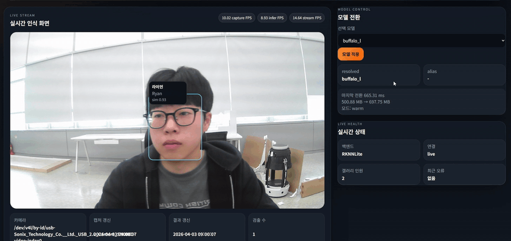
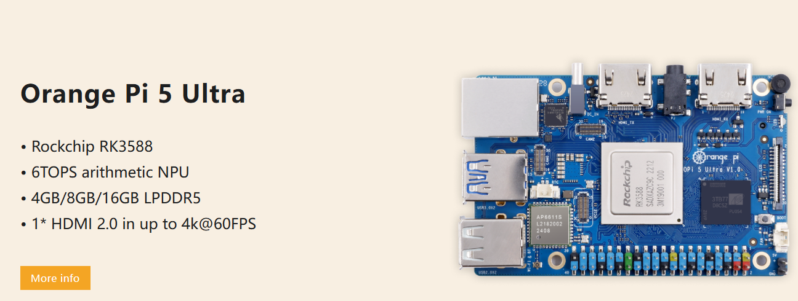
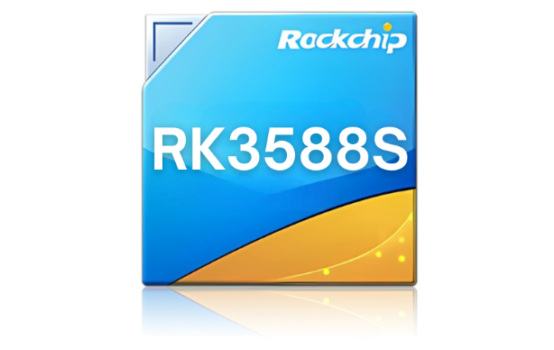
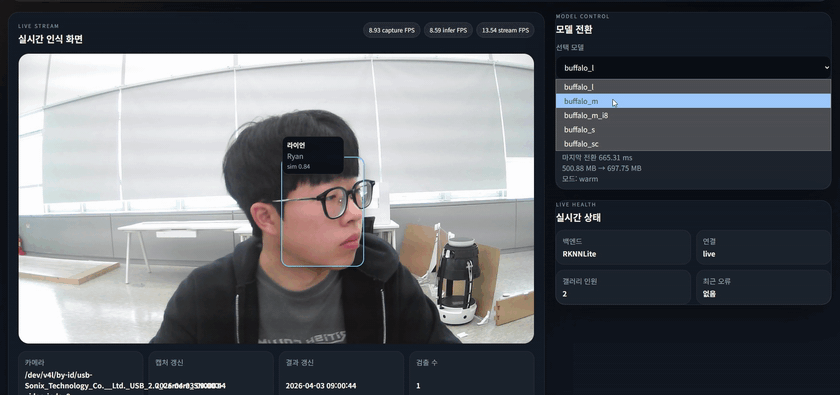
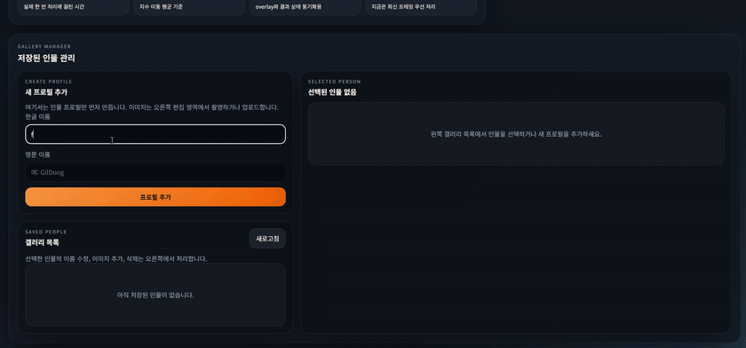
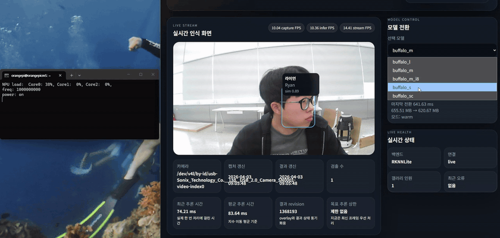

# InsightFace OrangePi RKNN

> `InsightFace` model zoo를 `Rockchip RK3588`용 `RKNN` model zoo로 정리하고, 이를 `SDK + web console` 형태로 묶어 `OrangePI`에서 바로 쓰기 쉽게 만든 프로젝트다.

<p align="center">
  
</p>

<p align="center">
  OrangePI RK3588에서 <code>buffalo_m</code> pack으로 실행한 실시간 얼굴 인식 화면이다.
</p>

## 한눈에 보기

- 최종 산출물은 두 축이다.
- 첫째는 앱 코드가 바로 import해서 쓰는 `RKNN FaceSDK`다.
- 둘째는 모델 전환, 갤러리 관리, 실시간 상태 확인을 맡는 `front / back` 분리형 web console이다.
- 실시간 주경로는 `InsightFace -> ONNX -> RKNN -> RKNN Lite2 -> OrangePI RK3588`다.
- CPU 경로는 benchmark와 비교 검증용이고, 제품 경로는 `RKNN`이다.
- 현재 canonical pack은 `buffalo_sc`, `buffalo_s(alias)`, `buffalo_m`, `buffalo_l`, 비교용 `buffalo_m_i8`다.
- 현재 안정된 기본 runtime pack은 `buffalo_m`으로 둔다.

<p align="center">
  
</p>

<p align="center">
  
</p>

## Demo

아래 영상은 OrangePI RK3588에서 얼굴 인식, 모델 전환, 갤러리 등록, NPU 동작을 실시간으로 확인한 데모다.  
README에는 표시용 GIF를 사용하고, 원본 입력 자산은 `repo/사용자 추가 폴더/` 기준으로 관리한다.  
데모 인물 표기는 현재 gallery metadata 기준 `라이언 / Ryan`으로 맞췄고, GIF 재생성 스크립트는 [assets/readme/build_demo_assets.py](assets/readme/build_demo_assets.py), 입력 메모는 [assets/readme/demo_assets.json](assets/readme/demo_assets.json)에 둔다.

| Live Recognition | Model Switching |
| --- | --- |
|  |  |
| `라이언 / Ryan`을 실시간으로 인식하는 화면 | `buffalo_l`, `buffalo_m_i8`, `buffalo_sc`를 바꿔 가며 같은 인물을 유지 |

| Gallery Registration | NPU Monitoring |
| --- | --- |
|  |  |
| 갤러리에 새 인물을 등록하고 즉시 인식에 반영 | `rknpu/load`와 web console을 같이 보며 NPU load 확인 |

## 이 저장소가 제공하는 것

- `conversion/`
  - InsightFace pack을 `RKNN`으로 변환하는 host-side toolchain
  - `pack.json` 기반 canonical model zoo
  - `INT8 calibration` 준비와 변환 매뉴얼
- `runtime/`
  - `FaceSDK`, `FaceWrapper` 기반 import-friendly SDK
  - gallery 로딩, 임베딩 비교, alias pack 해석
  - `FastAPI` backend + `React` frontend web console
  - OrangePI `systemd` service 설치 스크립트
- `assets/readme/`
  - root README가 직접 참조하는 데모 GIF와 하드웨어 이미지

## SDK Quick Start

OrangePI에서 바로 import해서 쓸 수 있는 가장 짧은 경로는 아래와 같다.

```bash
bash runtime/setup_orangepi_rknn_lite2_env.sh
source ../envs/ifr_rknn_lite2_cp310/bin/activate
```

```python
import cv2
from runtime import FaceSDK

frame = cv2.imread("runtime/results/face_benchmark_input.jpg")

sdk = FaceSDK(
    gallery_dir="runtime/gallery",
    model_pack="buffalo_m",
    backend="rknn",
    model_zoo_root="conversion/results/model_zoo",
)

print(sdk.describe())
print(sdk.list_gallery_people())
print(sdk.infer(frame))
sdk.close()
```

예제 스크립트는 아래 두 파일을 사용한다.

- 간단 사용법: [runtime/examples/sdk_quickstart.py](runtime/examples/sdk_quickstart.py)
- 커스텀 사용법: [runtime/examples/sdk_custom_usage.py](runtime/examples/sdk_custom_usage.py)

## Custom SDK Usage

기본 `infer(frame)` 외에도, 외부 사용자가 직접 제어할 수 있는 표면을 열어 두었다.

```python
import cv2
from runtime import FaceSDK

sdk = FaceSDK(
    gallery_dir="runtime/gallery",
    model_pack="buffalo_m",
    backend="rknn",
    model_zoo_root="conversion/results/model_zoo",
)

frame_a = cv2.imread("frame_a.jpg")
frame_b = cv2.imread("frame_b.jpg")

detections = sdk.detect_faces(frame_a)
embedding_a = sdk.extract_embedding(frame_a)
embedding_b = sdk.extract_embedding(frame_b)
gallery_matches = sdk.match_embedding(embedding_a, top_k=3)
pair_similarity = FaceSDK.compare_embeddings(embedding_a, embedding_b)

print(detections)
print(gallery_matches)
print(pair_similarity)
sdk.close()
```

현재 custom 표면은 아래 범위를 지원한다.

- `sdk.detect_faces(frame)`
- `sdk.extract_face_embeddings(frame)`
- `sdk.extract_embedding(frame, face_index=0)`
- `sdk.match_embedding(embedding, top_k=...)`
- `sdk.list_gallery_people()`
- `FaceSDK.compare_embeddings(embedding_a, embedding_b)`
- `FaceSDK.list_model_packs()`

## Web Demo

web demo는 `환경 준비`, `매번 수동 실행`, `service 실행`을 나눠 보는 편이 가장 명확하다.

### 환경이 아직 준비되지 않았을 때

아래 세 명령은 처음 1회 환경을 만들거나, 패키지 구성이 바뀌었을 때 다시 실행한다.

```bash
bash runtime/setup_orangepi_rknn_lite2_env.sh
bash runtime/setup_orangepi_rknn_web_env.sh
bash runtime/build_web_frontend.sh
```

- `setup_orangepi_rknn_lite2_env.sh`
  - RKNN Lite2와 런타임 기본 패키지를 준비한다.
- `setup_orangepi_rknn_web_env.sh`
  - web backend 실행에 필요한 패키지를 맞춘다.
- `build_web_frontend.sh`
  - frontend를 실제 배포용 정적 파일로 다시 빌드한다.

### 환경 준비가 끝난 뒤 매번 수동 실행할 때

아래 두 줄이 실제 수동 실행 명령이다.

```bash
source ../envs/ifr_rknn_lite2_cp310/bin/activate
python runtime/web_backend/main.py \
  --host 0.0.0.0 \
  --port 5000 \
  --camera-source /dev/v4l/by-id/usb-Sonix_Technology_Co.__Ltd._USB_2.0_Camera_SN0001-video-index0 \
  --gallery-dir runtime/gallery \
  --model-pack buffalo_m \
  --backend rknn \
  --inference-fps 0 \
  --model-zoo-root conversion/results/model_zoo \
  --frontend-dist runtime/web_frontend/dist
```

### service로 다시 실행할 때

service로 다시 올릴 때는 아래 명령을 사용한다.

```bash
bash runtime/install_orangepi_rknn_web_service.sh
sudo systemctl restart insightface_gallery_web.service
sudo systemctl status insightface_gallery_web.service
```

자세한 OrangePI 실행 절차와 서비스 운영 기준은 [runtime/README.md](runtime/README.md)에 둔다.

## Benchmark

### CPU baseline

- 실행 위치: `OrangePI RK3588`
- 실행 환경: `onnxruntime 1.23.2`, `CPUExecutionProvider`
- 결과 JSON: [runtime/results/260401_1530_ort_cpu_benchmark/summary.json](runtime/results/260401_1530_ort_cpu_benchmark/summary.json)
- 해석: CPU 경로는 비교 기준선이다. 제품 실시간 경로로 보지 않는다.

| model pack | detection model | recognition model | detection avg ms | recognition avg ms | pipeline avg ms | pipeline FPS |
| --- | --- | --- | ---: | ---: | ---: | ---: |
| `buffalo_sc` | `det_500m.onnx` | `w600k_mbf.onnx` | 49.21 | 23.09 | 139.57 | 7.16 |
| `buffalo_s` | `det_500m.onnx` | `w600k_mbf.onnx` | 50.60 | 27.01 | 160.37 | 6.24 |
| `buffalo_m` | `det_2.5g.onnx` | `w600k_r50.onnx` | 152.80 | 318.90 | 635.75 | 1.57 |
| `buffalo_l` | `det_10g.onnx` | `w600k_r50.onnx` | 573.89 | 429.12 | 1102.10 | 0.91 |

### RKNN NPU benchmark

- 실행 위치: `OrangePI RK3588`
- 실행 환경: `RKNN Lite2`
- 결과 JSON: [runtime/results/260403_0942_rknn_all_pack_benchmark/summary.json](runtime/results/260403_0942_rknn_all_pack_benchmark/summary.json)
- 조건: `warmup 5`, `repeat 20`
- 해석: 아래 표는 selectable pack 전체를 다시 측정한 device-side steady-state benchmark다.

| model pack | resolved pack | dtype | load ms | detection avg ms | recognition avg ms | pipeline avg ms | pipeline FPS | result count |
| --- | --- | --- | ---: | ---: | ---: | ---: | ---: | ---: |
| `buffalo_sc` | `buffalo_sc` | `FP16` | 354.14 | 54.02 | 6.28 | 46.96 | 21.29 | 1 |
| `buffalo_s` | `buffalo_sc` | `FP16` | 270.52 | 46.13 | 6.03 | 65.67 | 15.23 | 1 |
| `buffalo_m` | `buffalo_m` | `FP16` | 586.53 | 58.82 | 24.73 | 95.01 | 10.52 | 1 |
| `buffalo_m_i8` | `buffalo_m_i8` | `INT8` | 390.42 | 27.70 | 11.19 | 46.36 | 21.57 | 1 |
| `buffalo_l` | `buffalo_l` | `FP16` | 618.27 | 110.31 | 25.81 | 116.20 | 8.61 | 1 |

### 해석 요약

- CPU에서는 `buffalo_sc`와 `buffalo_s`가 그나마 실시간에 가까웠지만, `buffalo_m`, `buffalo_l`는 실시간 운영용으로는 무겁다.
- RKNN으로 옮기면 `buffalo_m`은 `95.01 ms / 10.52 FPS`, `buffalo_m_i8`는 `46.36 ms / 21.57 FPS`까지 내려온다.
- `buffalo_sc`는 가장 빠른 FP16 pack이고, `buffalo_m_i8`는 현재 가장 빠른 전체 pack이다.
- 기본 pack은 여전히 `buffalo_m`으로 유지하고, `buffalo_m_i8`는 비교용 후보로 계속 검증한다.

## `RKNN Lite2`는 무엇인가

`Lite`라는 이름은 여기서 성능 열화판을 뜻하는 것이 아니라, target device에서 쓰는 배포용 runtime 계층을 가리키는 명칭이다.

- `RKNN-Toolkit2`
  - host PC에서 `ONNX -> RKNN` 변환, build, quantization, calibration을 수행하는 개발 도구
- `RKNN Lite2`
  - OrangePI 같은 target device에서 `.rknn` 모델을 실제로 실행하는 runtime API

즉 이 프로젝트에서 `Lite2`를 쓰는 이유는 `RK3588 배포 장치에서 공식 runtime 경로가 그것이기 때문`이다.  
모델 품질과 정확도는 `원본 InsightFace pack`, `FP16/INT8 선택`, `calibration dataset`, `runtime 설정`이 결정하고, `Lite2`라는 이름 자체가 정확도 열화를 뜻하지는 않는다.

이 프로젝트에서는 host의 `Toolkit2`와 device의 `Lite2`가 역할을 나눠 동작한다.  
즉 변환과 양자화는 host에서, 실제 배포 추론은 device-side runtime에서 맡는 구조다.

## 변환과 검증 범위

이 저장소는 `공식 Rockchip 도구 체인`을 기반으로, `InsightFace`용 재현 가능한 변환 및 배포 레이어를 직접 구성한다.

- 공식으로 사용한 것
  - `rknn-toolkit2`
  - `rknnlite.api`
  - device-side `librknnrt`
- 이 repo에서 직접 구성한 것
  - InsightFace pack 선별과 alias 정책
  - detector / recognizer별 RKNN export
  - `pack.json` manifest와 `model zoo` 구조
  - `FaceSDK`, `FaceWrapper`, gallery manager
  - OrangePI benchmark, model switching, web console, service 운영

즉 source model은 `InsightFace`에서 오고, `.rknn` 산출물과 SDK/web 통합 레이어는 이 repository에서 `Toolkit2` 기준으로 직접 생성하고 검증한다.

## 현재 주경로

1. host에서 `InsightFace` 원본 pack을 준비한다.
2. `conversion/export_insightface_pack_rknn.py`로 detector와 recognizer를 `RKNN`으로 변환한다.
3. `conversion/results/model_zoo/rk3588/<pack>/pack.json`으로 canonical manifest를 만든다.
4. OrangePI에서 `RKNN Lite2` 환경을 준비한다.
5. 앱 코드는 `runtime.FaceSDK`를 import해서 detection, embedding, gallery match를 한 번에 쓴다.
6. 운영은 `runtime/web_backend/main.py`와 `runtime/web_frontend/` 기반 web console에서 관리한다.

## 저장소 구조

- `docs/`
  - 운영 규칙과 현재 truth
- `conversion/`
  - host-side RKNN 변환, calibration, model zoo
- `runtime/`
  - SDK, gallery, backend, frontend, service
- `assets/`
  - root README가 직접 참조하는 공용 자산

## 문서 지도

- 운영 규칙: [docs/AGENT.md](docs/AGENT.md)
- 현재 상태와 최근 로그: [docs/logbook.md](docs/logbook.md)
- RKNN 변환 매뉴얼: [conversion/README.md](conversion/README.md)
- OrangePI runtime / service 기준: [runtime/README.md](runtime/README.md)
- README 자산 생성 기준: [assets/readme/build_demo_assets.py](assets/readme/build_demo_assets.py)

## 현재 고정 메모

- wrapper가 주 제품이고 web console은 운영 인터페이스다.
- 현재 기본 runtime pack은 `buffalo_m`이다.
- `buffalo_m_i8`는 비교용 candidate pack으로 유지한다.
- `buffalo_s`는 `buffalo_sc` alias pack이다.
- gallery 저장 구조는 `runtime/gallery/<person_id>/meta.json`, `runtime/gallery/<person_id>/images/*`다.
- 현재 개발 보드 고정 LAN 주소는 `192.168.20.238`이다.
